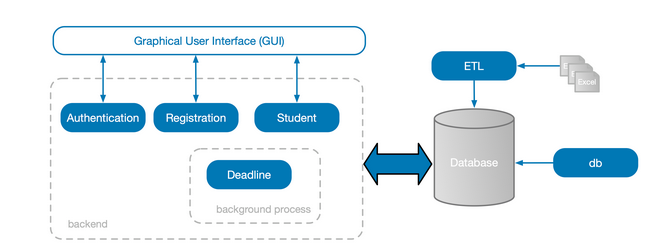
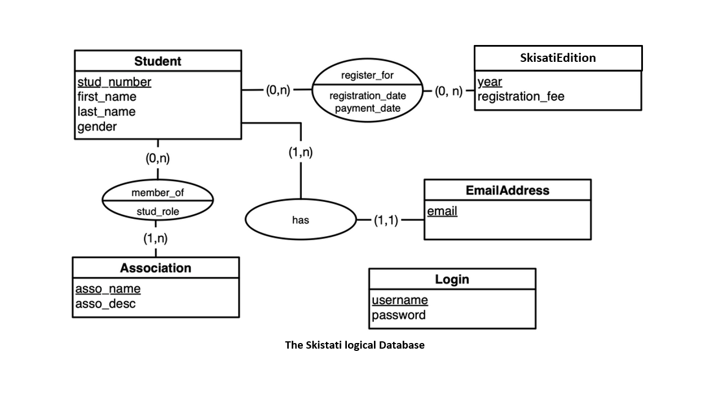
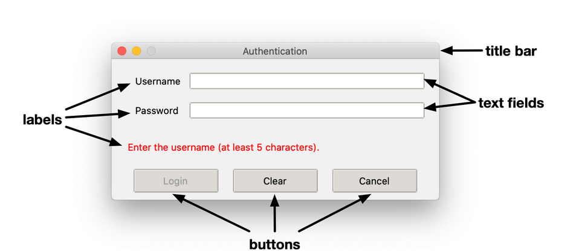
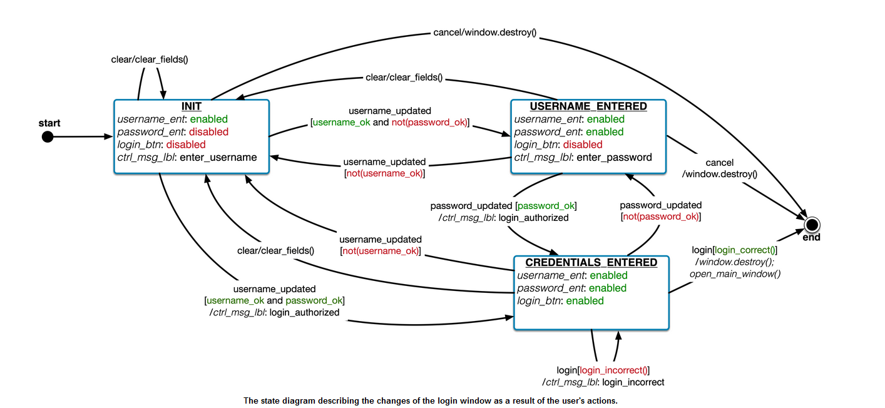

# Skisati

<!-- mettre en gras -->

_**This tutorial is totaly inspired of the tutorial TP Pistus of CentraleSupelec: 1CC1000 - Information Systems and Programming - Lab Pistus**_

__________________________________


In this tutorial, we'll develop a complete application that manages the registrations to an event.

In this tutorial you'll learn:

- How to make a Python program communicate with a relational database.
- How to create a simple graphical user interface.
- How to send emails from a Python program.
- How to handle authentication in Python. 

## Application description

Skisati (short for "Ski Isati") is an event organised by Isati (The BDE of Esir) during the winter every year. It's an awesome week-long mountain trip involving many activities (including skiing, snowboarding, raclette binges, and parties, just to name a few).

When a student wants to register for the Skisati, the organizers write to a spreadsheet (i.e., an Excel file) the student personal data, as well as the registration date and the registration fee. Students have the option to pay their dues immediately or later; in any case, the student must pay within 5 days of the registration, otherwise the registration is considered as expired and it is removed. The organizers will send a reminder by email 2 days before the deadline. Once the student pays, the organizers write the payment date to the spreadsheet.

The organizers keep two spreadsheets. One contains the registration data, that include the student personal data (student number, first and last name, gender and email addresses), the registration and payment dates, the registration fee and the year of the event. The other Excel file contains information on the association membership. 

This organization presents a lot of issues:

    If students participate to several Skisati editions in different years, their data is replicated for each registration. This might lead to inconsistencies. For instance, if a student changes her email address, the organizers should remove all the references to her old email address in the spreadsheets; these manual modifications are unlikely to be accurate.
    The organizers must manually check whether a student meets the payment deadline.
    The organizers must manually send email reminders to the students. 

For this reason, we want to develop a software, called SkisatiResa, that the organizers can use to manage the registrations in an efficient way.

The architecture of SkisatiResa is shown in the following Figure:

<!-- add picture architecture.png -->



The application consists of a graphical user interface (GUI) that allows an organizer to access all its functionalities. The backend consists of five modules, each dedicated to a specific functionality:

- The Student module allows an organizer to manage the students personal data.
- The Registration module allows an organizer to manage the registrations to the Skisati editions.
- The Authentication module provides the functionalities to restrict the use of SkisatiResa to authorized users.
- The Deadline module is a background process that manages the payment deadlines. Its two main functionalities are: sending an email reminder for unpaid registrations two days before the deadline and removing the expired registrations. 

SkisatiResa uses a relational database to store all the data. Two additional modules are used to create the database and import the data into it.

- The db module is used to create the database and its tables.
- The ETL (Extract, Transform, Load) module is used to import into the database the data on the past Skisati editions that are kept in the two spreadsheets mentioned above. 

## The skeleton of the application
The skeleton is composed of different folders and files.

    Most parts of the application are already implemented.
    Your goal is to complete the implementation by following the indications written in this document.
    The code is thoroughly commented and documented. For each function that you'll have to code, you'll find detailed instructions (i.e., what the function is supposed to do, the parameters taken by the function...) directly in the documentation of the function.

### The folder config

In folder config you'll find three files related to the configuration of the application.

- File config contains a list of key-value pairs describing the program settings:
    - The name and the language of the application,
    - The path to the database file,
    - The reference reference to the messages bundle file (see below).
    - Whether the authentication module of the application is enabled or not. 
- Files messages_bundle_en and messages_bundle_fr contain all the text (labels, buttons, error messages) shown in the application GUI in English and French respectively. In the bundle, each message is identified by a key. In the program code, each message is referred to by using its key; the actual message is not hard-coded in the program. This way, if we want to change the language, we can simply load a different bundle, without changing the code. 

### The folder data

The folder data contains all the data sources of the application. In particular, we find the two CSV files student_memberships.csv and student_registrations.csv that contain the data to import into the database. The database file itself will be created in this folder.

### The folder gui

This is a Python package that collects all modules implementing the application GUI. We'll dive deep into this folder later in this document.
The root folder

The root folder of the application contains the aforementioned folders and a bunch of Python files that implement the modules shown in the architecture.

- authentication.py, the Authentication module.
- db_playground.py, it contains the code you'll have to play with in order to learn how to implement the db module.
- db.py, the db module.
- etl.py, the ETL module.
- mdeadline_playground.py, examples for the Deadline module.
- mdeadline.py, the Deadline module.
- mregistration.py, the Registration module.
- mstudent.py, the Student module.
- pandas_playground.py, it contains some code you'll have to play with in order to learn how to use the Pandas library (useful to implement the ETL module).
- skisati.py, the main file of the application. Running this file will open a connection to the database and show the main window of SkisatiResa.
- utils.py, it defines some useful functions that are called in various points of the application. 

### Warming up

If you look at the main section in file skisati.py, you'll see that the first two functions that are invoked are: utils.load_config() and utils.load_messages_bundle(). Both are defined in file utils.py.

- load_config loads the key-value pairs of file ./config/config into a dictionary.
- load_messages_bundle loads the key-value pairs of file given as argument into a dictionary. 

<details><summary>How to read such files</summary>
If you look at the content of these files, you will see that the key-value pairs are written key,value, one on per line. This format belongs to the more general CSV (Comma Separated Values) format where each line contains a list of values separated by some specific character, usually a comma, but another one is possible. There is a Python library, csv to deal with these files.
</details>


**QUESTION 1**
> ```
> Implement both functions load_config and load_messages_bundle while respecting the instructions given in the documentation of the two functions.
> 
> When you're done implementing both functions, run the file utils.py as a Python script. This will invoke the instructions in the main section of the file (see bottom of the file) that test whether your implementation is correct. 
> 
> ```
> 
> >**[TODO]**
> >Once you've finished, commit your code and add the tag 'QS1'


## The database

In the SkisatiResa database, students are identified by a number and have a first and family name, gender and email addresses (a student can have more than one).

A student can belong to one or more associations; each association is described by a name (unique) and a textual description of its activities. Any student has a specific role in an association (e.g., president, secretary, member).

When a student registers for the Skisati, the year of the event, the registration and the payment date are stored, as well as the registration fee. The registration date and the payment date might be different. Importantly, a student can participate to different Skisati editions in different years, but cannot register twice for the same edition. 

<details><summary>How to derive a physical model</summary>
Rules to translate a logical data model into a physical data model:

- For each entity in the ER diagram, create a relational table. The attributes of the entity become the columns of the table.
- For each one-to-many relationship between an entity A and an entity B, take the set KB of attributes composing the primary key of B and add them to the attributes of A. The new attributes of A will be a foreign key referencing the primary key of B.
- For each many-to-many relationship R between two entities A and B, create a new relational table whose attributes are: all the attributes of R, the set KA of attributes composing the primary key of A and the set KB of attributes composing the primary key of B. The primary key of the new table is composed of all attributes in KA∪KB. The attributes in KA (respectively, KB) will be a foreign key referencing the corresponding attributes in A (respectively, B). 
</details>

The ER model of the Skisati database is shown in the following picture:


**QUESTION 2**
> ```
> Translate the ER diagram into a collection of relational tables. For each table, specify the primary and foreign keys.  
> 
> ```
> 
> >**[TODO]**
> >Ask your supervisor to validate the schema. And save it in the folder.


## The DB module

_The code for the DB module is in file db.py._

The DB module is responsible for creating the actual database and its tables. As a relational database management system (RDBMS) we use SQLite, as we did for the second tutorial of this course. In that tutorial, we used the program DB Browser for SQLite to create and manipulate a SQLite database. Here, we'll create and manipulate a SQLite database directly with in our application.

In file db.py we import the following modules:

- sqlite3, that we need to execute queries on a SQLite database.
- utils, a module that is part of the SkisatiResa application. 

When you execute the file db.py as a Python script, the Python interpreter executes the instructions after the statement if __name__ == "__main__" that you find at the bottom of the file.

You can directly read the comments in the file to understand what the code does. Here are a couple of things that you should retain :

In order to open a connection to a SQLite database, the following instruction is used: 
```python
conn = sqlite3.connect(db_file)
```
where db_file is the path to the file that will contain the database. In the code, the value of db_file is read from the SkisatiResa configuration file and is ./data/skisati.db.

We obtain a cursor, that is an object used to query the database, with the following instruction: 
```python
cursor = conn.cursor()
```

We close the connection to the database with the following instructions: 

```python
cursor.close()
conn.close()
```

The code to create the database is written in function create_database.

**QUESTION 3**
> ```
>  Read the code and the comments of function create_database to understand what it does.
>Then run the file db.py and:
>
> - Verify that the file ./data/skisati.db exists.
> - By opening the file ./data/skisati.db with DB Browser for SQLite, verify that the table Login exists in the database. 
> 
> ```

**QUESTION 4**
> 
> Complete the code from line 76 of function create_database to create the other tables in the database.
> 
> - We can name the table however you want, but you should use the same column names that we used in the ER diagram. This will make importing the data into the database much easier.
> - As for the column types:
>     - Use INTEGER for the column stud_number.
>     - Use REAL for the column registration_fee.
>     - Use TEXT for the other columns, including the dates (SQLite does not have an explicit type to represent dates). 
> 
> Run the file db.py and, by opening the file ./data/skisati.db with DB Browser for SQLite, verify that the tables that you created exist in the database. 
> >**[TODO]**
> >Once you've finished, commit your code and add the tag 'QS4'

### Playing with the database

_The code for the DB playground is in file db_playground.py_

We're now going to run some queries in the database in order to gain a deeper understanding on the interaction between the Python program and the database. For this, we'll work with file db_playground.py

**QUESTION 5**
>
> Read the code and the comments of function insert_student to learn how to run a parameterized query on the database and how to handle the sqlite3.IntegrityError.
>
>You can read the code and the comments of function insert_clara to learn how to use the function insert_student.

After the statement __name__ == "__main__" you'll find the instructions that are executed when you run the file as a script. The code opens a connection to the database and then calls the function insert_clara().

**QUESTION 6**

> Run the file db_playground.py and check whether Clara has been added to the database by using DB Browser for SQLite.
> 
> - How do you explain that you cannot find Clara in the database?
> - By looking at code that we used to create the tables, how would you modify the code in order to fix the problem?
> - Rerun the code after the modification and verify that Clara is in the database. 
>
> >**[TODO]**
> >Once you've finished, commit your code and add the tag 'QS6'


**QUESTION 7**
> Try to rerun the code. Which error do you get? Is it normal?
>
> >**[TODO]**
> >Write your explication below

```
Explications QS7
______________________________________________________
________________________________________________________
```

**QUESTION 8**

> Complete the function add_email_address that adds a student email address to the database.
> >**[TODO]**
> >Once you've finished, commit your code and add the tag 'QS8'


**QUESTION 9**


> Use the function add_email_address to add an email address of a non-existing student. What happens?
> >**[TODO]**
> >Write your explication below

```
Explications QS9
______________________________________________________
________________________________________________________
```

Don't hesitate to play with the code by running other queries on the database. When you're done, you might want to empty your database before importing the data from the spreadsheets, which is the goal of the ETL module. Use the DB Browser for SQLite to delete all the values that you added in this section. Remember to click on the button Write Changes at the end. 

## The ETL module

As explained in the introduction, for the past editions of Skisati the organizers had kept all the registration data in two spreadsheets; we now want to load all these data into the Skisati database. The ETL module is responsible for extracting the data from the spreadsheets, transforming and loading them into the database.

The two spreadsheets are available in the folder ./data as CSV files.

    The file student_registrations.csv contains the registrations to the Skisati editions 2016, 2017 and 2018.
    The file student_memberships.csv contains the data on the affiliation of the students to the different associations. 


If you look at the files, you will immediately notice that:

    Some data are replicated.
        First and last names and the email addresses of a student occur in both files;
        Some students (e.g., Ericka GUYOMARD) appear multiple times in both files because they participate to several Skisati editions or belong to more than one association. 
    The gender is expressed in different ways: men are referred to as M, H, or garçon and women as F, W or fille. 

Data replication is particularly a problem, because if we want to change some information about a student (e.g., the email address), we need to remember to change every occurrence of that information, otherwise the database will be in an inconsistent state.

All these anomalies in the data are referred to as noise; virtually all datasets present a certain amount of noise, that must be addressed before using the data. In other words, we need to clean the data before loading them into the database.

In order to implement the ETL module, we're going to use a Python package named Pandas; it is a powerful data manipulation and analysis library that is particularly indicated when working with tabular data, such as spreadsheets, CSV files and SQL tables.

Pandas provides functions to read data from these files into an in-memory two-dimensional data structure called dataframe. A dataframe is a two-dimensional data structure similar to an SQL table. A full documentation is available here.

The ETL module consists of three submodules:

    The Extraction (E) submodule. It extracts the content of the input CSV files and organizes it into several Pandas dataframes.
    The Transformation (T) submodule. It makes the data comply with certain requirements, in particular it cleans the data from the noise.
    The Load (L) submodule. It loads the transformed data into the database. 

Before diving into the implementation of the ETL module, we're going to learn how to use Pandas.

### Pandas playground

**QUESTION 10**

> Locate the statement if __name__ == "__main__" : in file pandas_playground.py and follow the instructions written in the comments from STEP 1. By playing with the code in file pandas_playground.py you'll learn:
> 
> - How to import a CSV file into a Pandas dataframe.
> - How to slice a Pandas dataframe.
> - How to find and replace values in a Pandas dataframe
> - How to remove duplicate values in a Pandas dataframe.
> - How to work with dates.
> - How to import Pandas dataframes to a relational database.
 


We'll now implement the three submodules of the ETL module.

### The Extraction submodule

The Extraction submodule is implemented in function extract() in file etl.py. This function must execute the following actions:

- Read the input CSV files ./data/student_registrations.csv and ./data/student_memberships.csv into two different Pandas dataframes.
-By using the slicing operation on these two dataframes, create a dataframe for each table in the relational database.
- Return the collection of the obtained dataframes. 

The function stores the dataframe collection into a dictionary, where each key is the name of a table in the database and each value is the corresponding Pandas dataframe.

**QUESTION 11**

> - Complete the code of the function extract() in file etl.py.
> - After the statement if ```__name__ == "__main__":```, remove the instruction pass and call the function extract().
> - Add some instructions to print the content of the dataframes returned by the function extract.
> - Run the file etl.py and verify that the dataframes are correctly created. 
>
> >**[TODO]**
> >Once you've finished, commit your code and add the tag 'QS11'

### The Transformation submodule

Before loading the data into the database, we need to transform them, that is remove the noise from the data. This is the job of the transformation submodule.

We find the following anomalies in our data:

- Duplicate rows in the dataframes corresponding to the tables Student, EmailAddress, Association and SkisatiEdition.
- The values in the column gender in the dataframe corresponding to the table Student are not uniform; males are referred to as M, H or garçon, while females as 'F', 'W' or 'fille'. The former should always be referred to by 'M', while the latter by 'F'.
- The dates in the columns registation_date and payment_date are in the format yyyy-mm-dd. We want them to be expressed as dd-mm-yyyy. 

The transformation submodule is implemented in function transform in file etl.py. The function takes in the dataframe collection output by the function extract() and returns the same collection, after all the transformations.

After the transformation:

    The dataframe containing the students should have 602 rows.
    The dataframe containing the associations should have 11 rows.
    The dataframe containing the email addresses should have 602 rows.
    The dataframe containing the membership information should have 895 rows.
    The dataframe containing the Skisati editions information should have 3 rows.
    The dataframe containing the registration information should have 900 rows. 

The shape attribute of a dataframe gives a tuple of its dimensions.

**QUESTION 12**

> Complete the code of function transform in order to remove the noise from the input dataframes.
> 
> - In the main section of file etl.py, call the function transform() after the function extract().
> - Add the instructions to print the content of the dataframes after the transformation.
> - Run the file etl.py and verify that the transformations have been correctly applied. 
>
> >**[TODO]**
> >Once you've finished, commit your code and add the tag 'QS12'

### The Load submodule

The data is now ready to be loaded into the Skisati database.

This is the job of the load submodule, implemented in function load in file etl.py.

This function takes in the dataframe collection output by the function transform().

**QUESTION 13**

> Complete the function load in file etl.py in order to load the input dataframes into the corresponding database tables.
> 
> - In the main section, call the function load() after the function transform.
> - Run the file etl.py and verify that the data has been correctly loaded into the database by using the DB Browser for SQLite. 
>
> >**[TODO]**
> >Once you've finished, commit your code and add the tag 'QS8'

## The Student module

The student module contains the functions necessary to add and edit student information in the database.

The code of the student module is in file mstudent.py.

In file mstudent.py, the following functions are defined but they are not implemented:

    - get_student, returns a student from the database.
    - get_associations, returns the associations from the database.
    - get_roles, returns the student roles in an association.
    - get_memberships, returns the associations of a specific student.
    - add_email_address, adds an email address of a specific student.
    - add_student, adds a student to the database.
    - add_membership, Adds a student to an association in the database.
    - delete_email_address, removes the email address of a student.
    - delete_membership, deletes the membership of a student to an association.
    - update_first_name, updates the first name of a student.
    - update_last_name, updates the last name of a student.
    - update_gender, updates the gender of a student.
    - update_email_address, updates the email address of a student.
    - update_membership, updates an existing membership of a student. 

Immediately before the definition of each function, we defined and implemented a test function that is called in the main section of file mstudent.py (see the bottom part of the file). Whenever you run file mstudent.py as a Python script, all the functions that you already implemented are tested. If no error is found, a positive message is shown; otherwise, the assertions defined in the test function raise an error that you'll have to analyse in order to understand the problem in your implementation.

**QUESTION 14**

> Implement all the functions in file mstudent.py that are flagged with the phrase "TODO: you'll have to implement this function".
> 
> - Implement the functions in the order in which they are defined. It'll make reading the output of the tests much easier.
> - Read carefully the comments in the file, they explain in details what each function is supposed to do, which parameters they take in and which result they're supposed to return.
> - After you finish the implementation of a function, run file mstudent.py as a Python script in order to trigger the corresponding test. 
>
> >**[TODO]**
> >Once you've finished, commit your code and add the tag 'QS14'

## The Registration module

The registration module provides the functions necessary to register students to a Skisati edition and manage all the information related to the registrations.

The code of the registration module is in file mregistration.py. This module is already implemented.

This module defines the following already implemented functions:

    - get_skisati_edition, that returns the data on a specific Skisati edition.
    - get_student_registrations, that returns all the registrations of a given student.
    - add_skisati_edition, that adds a new Skisati edition.
    - add_registration, that registers a student to a specific Skisati edition.
    - delete_registration, that deletes a specific registration.
    - update_registration_date, that updates the registration date of a registration.
    - update_payment_date, that updates the payment date of a registration. 

You can read the code and the comments in file mregistration.py and then you can jump to the next section. 

## The Graphical User Interface (GUI)

The Graphical User Interface (GUI) allows any SkisatiResa user to access all the application functionalities in an easy and intuitive way.

Several libraries, known as widget toolkits, exist to program a GUI in Python. For this tutorial, we choose Tkinter, which is built on top of the Tcl/Tk widget toolkit, for two reasons:

    - It is the standard built-in Python GUI library.
    - As opposed to other libraries, it is easy to learn. 

As a downside, the interfaces programmed with Tkinter look a bit rudimentary. However, if we need to quickly develop simple interfaces, Tkinter is an excellent choice.

The main element of a GUI is the window, that is a container that includes all the other GUI elements, usually referred to as widgets. The following figure shows the SkisatiResa login window that has a title bar and contains several widgets, including text fields, labels and buttons. These widgets are usually not added to the window directly; instead, they are grouped into frames (not visible in the figure); the first frame includes the Username and Password labels and text fields, the second includes the message label (Enter the username (at least 5 characters)) and the third the buttons. The advantage of using frames is that widgets in a frame can be arranged according to criteria that are different from the criteria adopted in other frames. 


Before jumping to the realization of the GUI, you'll have to learn how to use Tkinter.

### The GUI playground

We're now going to get started with Tkinter by playing with some examples.

You can copy and paste the code of the following examples into the file ./gui/playground.py.

#### Open a window

In order to open a window with title Playground, copy and paste the following code into the file ./gui/playground.py and execute it:

```python

window = tk.Tk()
window.title("Playground")
print("Opening the window")
window.mainloop()
print("The window is now closed")
```

The instruction window.mainloop() triggers the execution of the so-called event loop. During the event loop, the GUI listens for any event that might be triggered by the users' actions on the widgets, such as buttons clicks, keypresses and so on. Importantly, calling the function window.mainloop() blocks any code that comes after it. If you look at the terminal in Visual Studio Code, you should read the message Opening the window, while the message The window is now closed does not appear. That message appears only when you close the window, which breaks the event loop.

#### Add a label to the window

The following code creates a window containing a label that bears the text "First label":
```python
window = tk.Tk()
window.title("Playground")
my_label = tk.Label(window, text="First label")
my_label.pack()
window.mainloop()
```

Copy and paste this code into the file ./gui/playground.py (replace the previous code) and execute it. You should observe that now the window is large enough to contain the label, nothing less nothing more. This is the effect of using the function pack.

The function pack() invokes the pack geometry manager, that is responsible for placing the widgets in a window. Each time we invoke the function pack on a widget of that window, the geometry manager places the widget in the topmost portion of the window that is not occupied by another widget. When all the widgets are placed, the window is made large enough to hold them.


We can use the argument side of the function pack to force the geometry manager to add the widgets against the left, right or bottom side of the window, instead of the top one.

Another useful geometry manager is grid that allows the placement of widgets into a grid with a given number of rows and columns.

When we created the label with the instruction tk.Label (line 3), we specified two arguments: the parent window where the label should be placed and the text of the label. We can specify additional options, such as width and height. Try to replace the instruction at line 3 in the previous code with the following:
```python
my_label = tk.Label(window, width=10, height=10, text="First label")
```
You should note that, although we specified the same value for the label width and height, the label isn't square. This is because the size is specified in text units, that is the width (respectively, the height) of the character 0 (the number zero). This choice guarantees that the appearance of the widget is consistent across platforms. The widget will always have the size to display 10 zeroes, both horizontally and vertically, independently of the font used in the system where the application is run.

#### More widgets

Let's add some more widgets to our window! Replace the code in ./gui/playground.py with the following and execute the file:
```python
window = tk.Tk()
window.title("Playground")
my_label = tk.Label(window, text="First label")
my_text_field_var = tk.StringVar(value="")
my_text_field = tk.Entry(window, textvariable=my_text_field_var)
my_button = tk.Button(window, text="First button")
my_label.pack()
my_text_field.pack()
my_button.pack()
window.mainloop()
```
Beside the label, the window contains a text field, where the user can type some text that fits in one line, and a button, on which the user can click to trigger some action. For the time being, clicking on the button doesn't produce any action, because we didn't specify any. When we created the text field (Line 5), we specified the following arguments:

1. The parent window.
2. The argument textvariable, to which we passed the variable my_text_field_var (defined at Line 4) that stores the current content of the text field. This is useful when we want to track what the user is typing and react to it. We'll see an example below. 

The creation of the button is similar to the creation of the label.

Note that the function pack() is invoked for each widget that we want to add to the window.

#### Using ttk

Tkinter provides regular widgets (the ones that we used in the previous examples) that have a consistent look across all platforms; as a result, they look a bit primitive, and certainly different from the widgets that appear in other applications running on your operating system.

Since version 8.5, Tkinter made available a submodule called ttk containing themed widgets that are designed to look more native, that is similar to the widgets used in your operating system. For this reason, we use the widgets in the submodule ttk (note the instruction from tkinter import ttk at beginning of the file ./gui/playground.py).

ttk widgets are more difficult to style than regular widgets. In other words, it is more difficult to change the font or the background color. However, this part is out of the scope of this tutorial, and the styling configurations are already defined for you in file ./gui/gui_config.py.

Replace the code in ./gui/playground.py with the following code and execute it to see the difference in style:
```python
window = tk.Tk()
window.title("Playground")
configure_style()
my_label = ttk.Label(window, text="First label")
my_text_field_var = tk.StringVar(value="")
my_text_field = ttk.Entry(window, textvariable=my_text_field_var)
my_button = ttk.Button(window, text="First button")
my_label.pack()
my_text_field.pack()
my_button.pack()
window.mainloop()
```

1. At Line 3 we call the function configure_style defined in file ./gui/gui_config.py. This function configures the look and feel of the different widgets that we'll be using in the SkisatiResa GUI.
2. Instead of creating the label, the text field and the button with the instructions tk.Label, tk.Entry and tk.Button, we use the instructions ttk.Label, ttk.Entry and ttk.Button. 

In the following examples, and in the development of the SkisatiResa GUI, we'll be using the ttk widgets.

#### Using frames

In the previous examples, we added the widgets directly into the window. However, when the GUI consists of several widgets, it is useful to group them into frames; widgets that serve the same purpose (e.g. all the widgets that are used to collect the personal data of a student) are placed in the same frame.

A frame is not just a way to group related widgets into the same logical unit.

Since frames are independent of one another, each frame can use a different geometry manager; a frame can use the pack geometry manager, while another (in the same window) can use the grid geometry manager; or, two frames can both use the grid geometry manager, while using a different number of rows and columns.

Replace the code in ./gui/playground.py with the following code and execute it.
```python
window = tk.Tk()
window.title("Playground")
configure_style()
first_frame = ttk.Frame(window, style="Sample.TFrame")
first_label = ttk.Label(first_frame, text="First label", style="Sample.TLabel")
first_text_field_var = tk.StringVar(value="")
first_text_field = ttk.Entry(first_frame, textvariable=first_text_field_var)
first_button = ttk.Button(first_frame, text="First button")
first_label.pack()
first_text_field.pack()
first_button.pack()
first_frame.pack()
window.mainloop()
```
All the widgets are added to the frame first_frame.

When we create the frame (line 4), we use the argument style to specify the style of the frame; as a value, we specified Sample.TFrame, which is defined in function configure_style (file ./gui/gui_config.py) and sets the background color of the frame to yellow.

Similarly, we used styles to change the background color of the label to red (line 5).

Note that:

1. When we created the frame (line 4), we specified the window as its parent.
2. When we created the widgets (lines 5, 7 and 8), we specified the frame as their parent.
3. As a result, when we call the function pack() on the frame (line 12), the pack geometry manager places the frame into the window; when we call the function pack() on the label, text field and button (lines 9, 10 and 11), the pack geometry manager places the widgets into the frame. 


#### More on the pack geometry manager

If you try to resize the window, you'll see that the frame (the yellow portion) sticks to the top side of the window. This is the default behaviour of the pack geometry manager. You can change it, by giving the argument side of the function pack() one of the following values: tk.LEFT, tk.RIGHT and tk.BOTTOM.

For example, replace the instruction at Llne 12 of the previous code with the following:

```python
first_frame.pack(side=tk.LEFT)
```

If you execute the code and resize the window, you'll see that now the frame sticks to the left size of the window.

You certainly noticed that the frame does not expand while resizing the window. In order to enable this behaviour, we can use the arguments fill and expand. The possible values of fill are tk.X (the frame will fill the parent window horizontally), tx.Y (the frame will fill the parent window vertically) or tk.BOTH (the frame will fill the parent window both horizontally and vertically); the possible values of expand are True (the frame will expand while the parent window is resized) or False (the frame does not follow the resize of the parent window).
```python
first_frame.pack(side=tk.LEFT, fill=tk.BOTH, expand=True)
```

**QUESTION 15**


> Modify the code in ./gui/playground.py in order to make the label fill the parent frame (even when the frame is resized). Execute the code and try to resize the window.


Let's look at another example to better understand how the pack geometry manager works.

Replace the code in ./gui/playground.py with the following and execute it.
```python
window = tk.Tk()
window.title("Playground")
configure_style()
first_frame = ttk.Frame(window, style="Sample.TFrame")
first_label = ttk.Label(first_frame, text="First label", style="Sample.TLabel")
first_ent_var = tk.StringVar(value="")
first_text_field = ttk.Entry(first_frame, textvariable=first_ent_var)
first_button = ttk.Button(first_frame, text="First button")
first_label.pack(side=tk.LEFT)
first_text_field.pack()
first_button.pack()
first_frame.pack()
window.mainloop()
```

**QUESTION 16**


> Explain the position of the widgets in the window.


#### The grid geometry manager

The pack geometry manager is quite powerful, but it's difficult to use. An equally powerful, yet more intuitive geometry manager, is the grid geometry manager.

Replace the code in ./gui/playground.py with the following and execute it.
```python
window = tk.Tk()
window.title("Playground")
configure_style()
first_frm = ttk.Frame(window)
first_lbl = ttk.Label(first_frm, text="Grid (0, 0)", style="Sample.TLabel")
second_lbl = ttk.Label(first_frm, text="Grid (0, 1)", style="SampleTwo.TLabel")
third_lbl = ttk.Label(first_frm, text="Grid (1, 0)", style="SampleThree.TLabel")
fourth_lbl = ttk.Label(first_frm, text="Grid (1, 1)", style="SampleFour.TLabel")
first_lbl.grid(row=0, column=0)
second_lbl.grid(row=0, column=1)
third_lbl.grid(row=1, column=0)
fourth_lbl.grid(row=1, column=1)
first_frm.pack()
window.mainloop()
```
This code creates four labels (with different background colors) and arrange them into a grid with two rows and two columns (note the use of the function grid, instructions 9, 10, 11 and 12). Each row and column is identified by an index; both indices start at 0.

In the window created by the previous code, there is no space between the labels, which makes the GUI a little cluttered. We can free some space around the labels by using the arguments padx and pady of the function grid, as follows:
```python
first_lbl.grid(row=0, column=0, padx=10, pady=10)
second_lbl.grid(row=0, column=1, padx=10, pady=10)
third_lbl.grid(row=1, column=0, padx=10, pady=10)
fourth_lbl.grid(row=1, column=1, padx=10, pady=10)

In the following example, we add two frames to the window; each frame uses the grid geometry manager, but in the top frame the labels are arranged into a 4x4 grid, while in the bottom frame the labels are arranged into a 1x3 grid.
```python
window = tk.Tk()
window.title("Playground")
configure_style()

first_frm = ttk.Frame(window, style="Sample.TFrame")
ttk.Label(first_frm, text="Grid (0, 0)", style="Sample.TLabel").grid(row=0, column=0, padx=10, pady=10)
ttk.Label(first_frm, text="Grid (0, 1)", style="Sample.TLabel").grid(row=0, column=1, padx=10, pady=10)
ttk.Label(first_frm, text="Grid (1, 0)", style="Sample.TLabel").grid(row=1, column=0, padx=10, pady=10)
ttk.Label(first_frm, text="Grid (1, 1)", style="Sample.TLabel").grid(row=1, column=1, padx=10, pady=10)
first_frm.pack()

second_frm = ttk.Frame(window, style="SampleBottom.TFrame")
ttk.Label(second_frm, text="Grid (0, 0)", style="Sample.TLabel").grid(row=0, column=0, padx=10, pady=10)
ttk.Label(second_frm, text="Grid (0, 1)", style="Sample.TLabel").grid(row=0, column=1, padx=10, pady=10)
ttk.Label(second_frm, text="Grid (0, 2)", style="Sample.TLabel").grid(row=0, column=2, padx=10, pady=10)
second_frm.pack()

window.mainloop()


```

**QUESTION 17**

> In the window produced by the previous code, the top frame doesn't fill the window. Modify the code to do so. Execute the file.


In the window produced by the code that you modified, the labels in the top frame stick to the left side of the frame. If we want them to be spread uniformly across the frame, we need to call the function columnconfigure() on the top frame, as follows (put these two lines right before the instruction that you modified at the previous question):
```python
first_frm.columnconfigure(0, weight=1)
first_frm.columnconfigure(1, weight=1)
```
The function columnconfigure() takes in two arguments: the index of the column to configure and the weight that sets the rate of expansion of the widgets (typically, one uses 1) when the frame is resized. You can try different values of weight (not necessarily the same value for the two columns) and resize the window to see the effect of this argument.

An equivalent function rowconfigure() exists.

Finally, we note that each label is placed right at the center of their respective cells. We can change this behaviour by using the argument sticky of the function grid(). The possible values of sticky are: 'w' (west=left alignment), 'e' (east=right alignment), 'n' (north=top alignment) and s (south=bottom alignment), or any concatenation of these values (e.g., 'ew').

For instance, change the placement of the label at (0, 0) in the top frame with the following code:

ttk.Label(first_frm, text="Grid (0, 0)", style="Sample.TLabel").grid(row=0, column=0, padx=10, pady=10, sticky='ew')

Since we use the value 'ew' for the argument sticky, the label spans horizontally the whole cell. You can play with different values to see what you obtain.

#### Event handling

The interfaces that we played with so far do not react to the user's actions. Each action (e.g., typing text in a text field, clicking a button) generates an event. For each event that we want to capture, we have to write the code that will be executed in response to that event; in other words, we associate to each event a function that is called when the event happens. This function is called an event handler or callback.

Replace the code in ./gui/playground.py with the following:
```python
def click_ok_handler():
    print("The user clicked OK")

window = tk.Tk()
window.title("Playground")
configure_style()
first_frm = ttk.Frame(window, style="Tab.TFrame")
button = ttk.Button(first_frm, text="OK", command=click_ok_handler)
button.pack()
first_frm.pack()
window.mainloop()
```
This code:

    Defines a function click_ok_handler() that prints the message "The user clicked OK" to the terminal.
    Creates a frame and adds a button.
    Uses the argument command of ttk.Button to assign the function click_ok_handler() to the button. This means that whenever the user clicks the button OK, the function click_ok_handler() is invoked. 

Execute the code and try for yourself. Each time you click the button OK, the messages "The user clicked OK" should appear in the Visual Studio Code terminal.

Let's look at another more complex example:
```python
entries = {}
buttons = {}

def click_ok_handler():
    print("The user clicked OK")

def check_first_ent(*args):
    text_field_content = entries["first_ent"][1].get().strip()
    print("The user typed {}".format(text_field_content) )
    if text_field_content[-1] == "#":
        ok_enabled_state()
    else:
        ok_disabled_state()

def ok_enabled_state():
    buttons["OK"].configure(state=["!disabled"])
    print("The button is now enabled")

def ok_disabled_state():
    buttons["OK"].configure(state=["disabled"])
    print("The button is now disabled")

window = tk.Tk()
window.title("Playground")
configure_style()
first_frm = ttk.Frame(window, style="Tab.TFrame")

first_ent_var = tk.StringVar(value="")
first_ent = ttk.Entry(first_frm, textvariable=first_ent_var)
first_ent_var.trace("w", check_first_ent)
entries["first_ent"] = (first_ent, first_ent_var)
first_ent.pack()

button = ttk.Button(first_frm, state="disabled", text="OK", command=click_ok_handler)
buttons["OK"] = button
button.pack()
first_frm.pack()
window.mainloop()
```
Execute the code: the interface consists of a text field and a button. Initially, the button is disabled. When you type something in the text field, its content is printed to the Visual Studio Code terminal; the button is enabled only if the last character in the text field is "#".

Let's have a closer look at the code to see how we realized that.

- In Lines 28-32 we create the text field and we add it to the window. The current content of the text field is stored in the variable first_ent_var (line 29).
- In lines 34-37 we create the button and we add it to the window.
- Line 30: we associate the callback check_first_ent to the variable first_ent_var by invoking the function trace(). This function takes in two arguments:
    - "w" indicates that the callback is triggered when the user changes the current content of the text field.
    - check_first_ent, the callback. 
- Line 31: we add the tuple (first_ent, first_ent_var) to the dictionary entries defined as a global variable at the beginning of the file. This way, both the text field and the variable holding its content can be accessed from the callbacks defined at the beginning of the file.
- Line 34: we create the button and we specify that it's disabled by setting the argument state to "disabled".
- Line 35: we add the button to the dictionary buttons that we define at the beginning of the file. This way, the button will be visible in the callbacks. 

Let's now read the function check_first_ent() that is invoked when the user changes the content of the text field.

- Line 7: the function takes in *args as argument. Remember that we associated check_first_ent() to the variable first_ent_var by using the function trace(). When using trace(), tkinter calls the associated callback and passes some arguments. Since we won't use them, we can safely ignore them.
- Line 8: we obtain the current content of the text field. To this purpose, we call the function get() on the variable that holds the content of the text field (remember, we find this variable in the dictionary entries). We invoke the function strip() on the text field content because we want to remove any trailing or leading white spaces added by the user.
- Line 9: we print the current content of the text field to the Visual Studio Code terminal.
- Lines 10-13: if the last character in the text field is "#", we transition to the state where the button is enabled (read the function ok_enabled_state()); otherwise, we transition to the state where the button is disabled (read the function ok_disabled_state()). 

**QUESTION 18** 

> Read and execute the following code and try to understand how radio buttons are created and how events are handled.
> ```python
> radio_buttons = {}
> buttons = {}
> 
> def click_ok_handler():
>     print("The user clicked OK")
> 
> def rb_selected(*args):
>     current_value = radio_buttons["enable_disable"][2].get()
>     if current_value == 'E':
>         ok_enabled_state()
>     elif current_value == 'D':
>         ok_disabled_state()
> 
> def ok_enabled_state():
>     buttons["OK"].configure(state=["!disabled"])
>     print("The button is now enabled")
> 
> def ok_disabled_state():
>     buttons["OK"].configure(state=["disabled"])
>     print("The button is now disabled")
> 
> window = tk.Tk()
> window.title("Playground")
> configure_style()
> first_frm = ttk.Frame(window, style="Tab.TFrame")
> 
> rb_value = tk.StringVar(value="")
> rb_value.trace("w", rb_selected)
> enable_rb = ttk.Radiobutton(first_frm, text='Enable', value='E', variable=rb_value)
> disable_rb = ttk.Radiobutton(first_frm, text='Disable', value='D', variable=rb_value)
> radio_buttons["enable_disable"] = (enable_rb, disable_rb, rb_value)
> enable_rb.pack()
> disable_rb.pack()
> 
> button = ttk.Button(first_frm, state="disabled", text="OK", command=click_ok_handler)
> buttons["OK"] = button
> button.pack()
> first_frm.pack()
> window.mainloop()
> ```

**QUESTION 19**

> Read and execute the following code and try to understand how combo boxes are created and how events are handled.
> ```python
> combo_boxes = {}
> buttons = {}
> control_labels = {}
> 
> window = None
> 
> def combo_selected():
>     current_color = combo_boxes["color"].get()
>     control_labels["color_ctrl"].configure(text="The selected color is {}".format(current_color))
> 
> def destroy_window():
>     window.destroy()
> 
> window = tk.Tk()
> window.title("Playground")
> configure_style()
> first_frm = ttk.Frame(window, style="Tab.TFrame")
> 
> ctrl_label = ttk.Label(first_frm)
> control_labels["color_ctrl"] = ctrl_label
> ctrl_label.pack()
> 
> colors = ["red", "green", "blue", "yellow"]
> color_combo = ttk.Combobox(first_frm, values=colors)
> combo_boxes["color"] = color_combo
> color_combo.bind("<<ComboboxSelected>>", \
>         lambda event: combo_selected())
> color_combo.pack()
> 
> button = ttk.Button(first_frm, text="Destroy", command=destroy_window)
> buttons["OK"] = button
> button.pack()
> 
> first_frm.pack()
> window.mainloop()
> ```

Note how we destroy the window (and, consequently, we close the application) in function destroy_window. 


### The login window

You're now going to create the login window by using the Tkinter tools that you learned above.

The SkisatiResa login window

It is important to understand how the application SkisatiResa is executed in the first place.

The entry point of the application is file skisati.py; when you execute this file as a Python script, the following instructions are executed (read the code to identify these actions):

1. Load the application configuration from file ./config/config.
2. Load the messages bundle in the language indicates in the configuration.
3. Connect to the database, of which the file path is specified in the configuration file.
4. If authorization is enabled in the configuration file, a login window is displayed.
5. If authorization is not enabled, the main window of the application pops up.
6. Whenever the user closes the application main window, SkisatiResa closes the connection to the database and stops its execution.

In our configuration file, authorization is enabled, so SkisatiResa calls the function open_login_window defined in file ./gui/login.py where the login window is created.

If you run the file skisati.py right now, no window will appear because the login window is not implemented yet. The application immediately terminates by executing the last instruction in file skisati.py, which prints the message: PistuResa is not running anymore.

**QUESTION 20**

> Open file ./gui/login.py and follow the instructions to create the login window.
> 
> - Make sure you read the code from top to bottom, including the comments, so you'll understand what you have to do.
> - For now, just implement the graphical part, we'll add the event handlers later.
> - You'll need to implement three functions: _credentials_frm_widgets, _message_frm_widgets and _buttons_frm_widgets. Each time you finish implementing a function, executes the file skisati.py to see if the interface looks as expected. 
> >**[TODO]**
> >Once you've finished, commit your code and add the tag 'QS20'

#### Event handling

The following figure shows how the login window changes as a result of the user's actions on its widgets.

The state diagram describing the changes of the login window as a result of the user's actions.

Here is a detailed description of the diagram (follow the numbers in the figure):

1. Initially, the window is in the INIT state. The password text field and the button login are disabled; the control label shows the message messages_bundle["enter_username"];
2. While the user is typing the username, the entered username is checked to verify that it meets certain validity criteria (username_ok); if so (the password is not OK because the user hasn't typed anything yet), the window transitions to the USERNAME_ENTERED state;
3. In the USERNAME_ENTERED state, only the button login is disabled; the control label shows the message messages_bundle["enter_password"];
4. If the user changes the username, and the username does not meet the validity constraint, the window transitions back to the INIT state;
5. If the user types in a password, and the password meets certain validity criteria, the window transitions to the state CREDENTIALS_ENTERED; the message messages_bundle["login_authorized"] is shown in the control label;
6. In the CREDENTIALS_ENTERED state, all fields are enabled, including the button login;
7. If the user changes the password, and the password does not meet the validity criteria, the window transitions back to the state USERNAME_ENTERED;
8. If the user changes the username, and the username does not meet the validity criteria, the window transitions back to the state INIT; the password text field will be disabled, but its current value is maintained;
9. If the user changes the username, and both the username and the password meet the validity constraints, the window transitions directly to the state CREDENTIALS_ENTERED;
10. If the user click the button login, and the username and password are not correct, the window stays in the state CREDENTIALS_ENTERED and the message messages_bundle["username_not_found"] or messages_bundle["incorrect_password"] is displayed in the control label;
11. If the user clicks the button login, and the username and password are correct, the login window is destroyed and the SkisatiResa main window is opened; 

In any state, if the user clicks the button clear, all fields are cleared and the window transitions back to the state INIT; if the user clicks the button cancel, the login window is destroyed.


**QUESTION 21**

> Implement the functions username_ok and password_ok in file utils.py.
> 
> The function username_ok returns True if the username meets the following validity criteria :
> 
> - The username has 5 characters or more. 
> 
> The function password_ok returns True if the password meets the following validity criteria :
> 
> - The password has 5 characters or more.
> - The password must contain at least one capital letter.
> - The password must contain at least one digit.
> - The password must contain at least one symbol character (@,!,#,$) 
> 
> Run utils.py to trigger the tests of these two functions.
> >**[TODO]**
> >Once you've finished, commit your code and add the tag 'QS21'


**QUESTION 22**

> - Implement the functions init_state, username_entered_state, credentials_entered_state, username_updated and password_updated in file login.py (follow the instructions in the comments attached to these functions).
> - Declare the functions username_updated and password_updated as callbacks associated to the text fields username and password.
> - Run skisati.py and verify that the window correctly changes state when you type the username and the password. 
> >**[TODO]**
> >Once you've finished, commit your code and add the tag 'QS22'

**QUESTION 23**

> - Implement the functions login, clear and cancel (see the instructions in the comments in file login.py).
>     - As indicated in the comments, the function login will call the function auth.login_ok(); in the current implementation, the only correct username and password to successfully log in are "admin" and "Adm1n!" respectively. 
> - Associate these three functions as callbacks of the buttons login, clear and cancel.
> - Run skisati.py to verify that you can successfully log in and open the SkisatiResa main window. 
> >**[TODO]**
> >Once you've finished, commit your code and add the tag 'QS23'

**QUESTION 24[Advanced only]**


> Add to the login window a combobox that allows the user to select the language of the application. When the user successfully logs in, the SkisatiResa main window appears in the language selected by the user.
> >**[TODO]**
> >Once you've finished, commit your code and add the tag 'QS24'

### The main window

The main window has a menu on the left and allows the user to open three tabs, one for adding/editing the student data, another to add a registration to a SkisatiEdition and the third to edit the registrations of a student. Try to play with the interface in order to verify that the functions that you coded in the Student and Registration modules work correctly.

## The authentification module

The Authentication module provides two functionalities:
- Account creation. Any account is identified by a username and is associated to a password.
- Login procedure. In order to get access to SkisatiResa, any user has to connect by specifying her username and password. 

When an account is created, the username and the password are stored to table Login in the Skisati database. For security reasons, the password is stored in hashed form, rather than plain text. To this extent, we'll be using a hashing algorithm that transforms the password into another string that is virtually impossible to transform back to the original string.

In order to hash a password, we will be using the Python package passlib.

Open file authentication.py.

At the top of the file, we define a variable pwd_context, which allows us to specify the hashing algorithm to use in order to encrypt the password.

Here we use the algorithm pbkdf2_sha256 (the description of this algorithm is out of the scope of this tutorial); as configuration parameter, we specify the number of rounds. A round is part of the hashing algorithm that is iterated many times; the more iterations you specify, the harder the hashed password will be to decrypt (but the longer the computational time).

The function encrypt_password takes in a plain text password and invokes the function hash on pwd_context; this will return the hashed version of the password.

**QUESTION 25**

> - Implement the function create_account. Follow the instructions given in the comments associated to the function.
> - Run file authentication.py. This will execute the main portion of this file. You'll be prompted to enter a username and a password in the Visual Studio Code terminal; these credentials will be then passed to the function create_account.
> - Verify that the username and password that you entered appear in the table Login. 
> >**[TODO]**
> >Once you've finished, commit your code and add the tag 'QS25'

When a user wants to log in, she provides her username and password. The provided password is hashed with the same algorithm used to encrypt it the first time. The hashed form of the provided password will be compared with the hashed form stored in the database. If the two passwords match, the user will be granted access to SkisatiResa.

**QUESTION 26**

> - Write another implementation of function login_correct that checks the provided username and password are correct. 
> 
> Follow the instructions in the comments associated to the function.
> 
> - Execute file skisati.py and log in with the account that you created at the previous question. 
> >**[TODO]**
> >Once you've finished, commit your code and add the tag 'QS26'

## The Deadline module

The Deadline module is a background process that is executed as soon as the application SkisatiResa is opened and then every 24 hours. At each execution, this module does the following operations:

- Retrieves the unpaid registrations, for which the students did not paid their dues.
- In the unpaid registrations, it identifies the expired registrations (the registration date is more than 5 days from the current date) and the late registrations (the registration date is less than 5 days from the current date).
- Removes the expired registrations.
- Sends a reminder by email to the students who have late registrations.

In order to learn how to start a background process and send an email, read the code and the comments in file mdeadline_playground.py. Execute the code.

The deadline module is implemented in file mdeadline.py. In this file, the following functions are already implemented (make sure you read the code and the comments to learn how they are implemented):

- deadline. Returns the payment deadline, given the registration date.
- deadline_expired. Returns True if the payment deadline is expired, given a registration date.
- deadline_aproaching. Returns True if the payment deadline is in two days from the current date. This function is used to identify the late registrations, for which an email reminder is necessary.
- deadline_management_init. Initializes some of the global variables defined in the file. This function is called at the bottom of function open_main_window in file ./gui/mainwindow.py. 

**QUESTION 27**

> By following the instructions written in the comments of file ./mdeadline.py, implement the following functions (to manage the dates you can use the already implemented functions discussed above):
> 
> - _unpaid_registrations. Returns all the unpaid registrations.
> - _expired_registrations. Returns all the registrations for which the payment deadline is expired.
> - _late_payment_registrations. Returns the registrations for which the payment deadline is two days from the current date.
> - _remove_expired_registrations. Removes all the expired registrations from the database.
> - _send_late_payment_reminder. Sends an automatic email to all students having late registrations.
> - deadline_management. This is the function that is invoked periodically to do the operations of the deadline module. 
> 
> Retrieve the expired and late registrations from the database, note them down somewhere, and only then execute skisati.py to verify that the email reminders are sent to the correct students and the expired registrations are actually removed.
> >**[TODO]**
> >Once you've finished, commit your code and add the tag 'QS27'
The application SkisatiResa. Play with it and, if you still have time, have fun adding any functionality that you might find useful!


